Standard pre-processing of scRNA-seq analysis
================

For this tutorial, we will be analyzing the Peripheral Blood Mononuclear
Cells (PBMC) data available from 10X Genomics. The data comprises of
2,700 single cells that were sequenced on the Illumina NextSeq 500.

### 1. Set working directory and load libraries

``` r
# setwd("Github/10XGenomics_Pipeline/1. scRNA-seq/")
```

``` r
# Tool for QC, normalization, dimensionality reduction and clustering of single cell datsests
library(Seurat) 
```

    ## Warning: package 'Seurat' was built under R version 4.4.3

    ## Loading required package: SeuratObject

    ## Warning: package 'SeuratObject' was built under R version 4.4.3

    ## Loading required package: sp

    ## Warning: package 'sp' was built under R version 4.4.3

    ## 
    ## Attaching package: 'SeuratObject'

    ## The following objects are masked from 'package:base':
    ## 
    ##     intersect, t

``` r
## Tool for data manipulation, cleaning, and visualization of tabular data
library(tidyverse) 
```

    ## Warning: package 'ggplot2' was built under R version 4.4.3

    ## Warning: package 'lubridate' was built under R version 4.4.2

    ## ── Attaching core tidyverse packages ──────────────────────── tidyverse 2.0.0 ──
    ## ✔ dplyr     1.1.4     ✔ readr     2.1.5
    ## ✔ forcats   1.0.0     ✔ stringr   1.5.1
    ## ✔ ggplot2   3.5.2     ✔ tibble    3.2.1
    ## ✔ lubridate 1.9.4     ✔ tidyr     1.3.1
    ## ✔ purrr     1.0.2

    ## ── Conflicts ────────────────────────────────────────── tidyverse_conflicts() ──
    ## ✖ dplyr::filter() masks stats::filter()
    ## ✖ dplyr::lag()    masks stats::lag()
    ## ℹ Use the conflicted package (<http://conflicted.r-lib.org/>) to force all conflicts to become errors

### 2. Load the PBMC dataset

The raw data can be found here-
<https://s3-us-west-2.amazonaws.com/10x.files/samples/cell/pbmc3k/pbmc3k_filtered_gene_bc_matrices.tar.gz>.
Download and extract the tar.gz archive. This unpacks the barcode, gene,
and matrix files needed for downstream analysis.

``` r
# Read the 10x Genomics matrix directory into R
pbmc.data <- Read10X(data.dir = "./data/filtered_gene_bc_matrices/hg19/")

# Initialize the Seurat object with the raw (non-normalized data).
pbmc <- CreateSeuratObject(counts = pbmc.data, project = "pbmc3k", min.cells = 3, min.features = 200)
```

    ## Warning: Feature names cannot have underscores ('_'), replacing with dashes
    ## ('-')

``` r
# Print a summary of the newly created Seurat object
pbmc
```

    ## An object of class Seurat 
    ## 13714 features across 2700 samples within 1 assay 
    ## Active assay: RNA (13714 features, 0 variable features)
    ##  1 layer present: counts

``` r
# Lets examine a few genes in the first thirty cells
pbmc.data[c("CD3D", "TCL1A", "MS4A1"), 1:30]
```

    ## 3 x 30 sparse Matrix of class "dgCMatrix"

    ##   [[ suppressing 30 column names 'AAACATACAACCAC-1', 'AAACATTGAGCTAC-1', 'AAACATTGATCAGC-1' ... ]]

    ##                                                                    
    ## CD3D  4 . 10 . . 1 2 3 1 . . 2 7 1 . . 1 3 . 2  3 . . . . . 3 4 1 5
    ## TCL1A . .  . . . . . . 1 . . . . . . . . . . .  . 1 . . . . . . . .
    ## MS4A1 . 6  . . . . . . 1 1 1 . . . . . . . . . 36 1 2 . . 2 . . . .

The symbol “.” represent zeros (no detected molecules). Because
single-cell RNA-seq datasets are inherently “sparse”—meaning the vast
majority of values are zero—Seurat stores this data as a sparse matrix.
By only tracking the non-zero coordinates rather than storing every
single zero, Seurat drastically reduces memory usage and speeds up
processing times for droplet-based workflows (like 10x Genomics,
Drop-seq, and inDrop).

#### 3. Standard pre-processing workflow

This pipeline takes noisy, high-dimensional raw sequencing counts and
processes them into biologically interpretable clusters:

#### 3a. Quality Control (QC)

Droplet-based single-cell protocols are imperfect; they frequently
capture empty droplets, cell doublets (two cells trapped together), or
dying cells. To ensure our downstream analysis is built only on viable,
high-quality cells, we evaluate three primary metrics:

**nFeature_RNA** : number of distinct genes detected in an individual
cell. Low counts usually indicate empty droplets or poor-quality cells
where the sequencing failed. High counts often indicate doublets or
multiplets (two or more cells captured in a single droplet).

**nCount_RNA** : total number of unique molecular identifiers (UMIs)
detected within a cell. This correlates strongly with the unique gene
count and helps identify overall sequencing depth per cell.

**percent.mt** : proportion of reads that map to the mitochondrial
genome. High percentages are a classic signature of dying cells.

``` r
# Calculate the percentage of total reads that map to mitochondrial genes for each cell.
pbmc[["percent.mt"]] <- PercentageFeatureSet(object = pbmc, pattern = "^MT-")

# Show QC metrics for the first few rows of the metadata
head(pbmc[])
```

    ##                  orig.ident nCount_RNA nFeature_RNA percent.mt
    ## AAACATACAACCAC-1     pbmc3k       2419          779  3.0177759
    ## AAACATTGAGCTAC-1     pbmc3k       4903         1352  3.7935958
    ## AAACATTGATCAGC-1     pbmc3k       3147         1129  0.8897363
    ## AAACCGTGCTTCCG-1     pbmc3k       2639          960  1.7430845
    ## AAACCGTGTATGCG-1     pbmc3k        980          521  1.2244898
    ## AAACGCACTGGTAC-1     pbmc3k       2163          781  1.6643551
    ## AAACGCTGACCAGT-1     pbmc3k       2175          782  3.8160920
    ## AAACGCTGGTTCTT-1     pbmc3k       2260          790  3.0973451
    ## AAACGCTGTAGCCA-1     pbmc3k       1275          532  1.1764706
    ## AAACGCTGTTTCTG-1     pbmc3k       1103          550  2.9011786

``` r
# Visualize QC metrics as a violin plot
VlnPlot(object = pbmc, features = c("nFeature_RNA", "nCount_RNA", "percent.mt"), ncol = 3)
```

    ## Warning: Default search for "data" layer in "RNA" assay yielded no results;
    ## utilizing "counts" layer instead.

    ## Warning: The `slot` argument of `FetchData()` is deprecated as of SeuratObject 5.0.0.
    ## ℹ Please use the `layer` argument instead.
    ## ℹ The deprecated feature was likely used in the Seurat package.
    ##   Please report the issue at <https://github.com/satijalab/seurat/issues>.
    ## This warning is displayed once every 8 hours.
    ## Call `lifecycle::last_lifecycle_warnings()` to see where this warning was
    ## generated.

    ## Warning: `PackageCheck()` was deprecated in SeuratObject 5.0.0.
    ## ℹ Please use `rlang::check_installed()` instead.
    ## ℹ The deprecated feature was likely used in the Seurat package.
    ##   Please report the issue at <https://github.com/satijalab/seurat/issues>.
    ## This warning is displayed once every 8 hours.
    ## Call `lifecycle::last_lifecycle_warnings()` to see where this warning was
    ## generated.

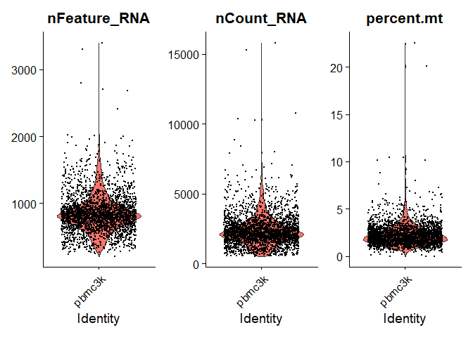<!-- -->

**nFeature_RNA (Unique Genes)**: Most cells contain between 500 and
1,000 unique genes. The long thin tail at the top shows a few cells
reaching over 2,500 to 3,000 genes—these are highly likely to be
doublets (two cells in one droplet) and should be trimmed.

**nCount_RNA (Total Molecules/UMIs)**: This mirrors the gene count plot,
showing that most cells have around 2,500 total RNA molecules detected,
with a few extreme outliers extending up to 15,000.

**percent.mt (Mitochondrial Percentage)**: The vast majority of your
cells have a very low mitochondrial read percentage (under 5%), which
indicates a highly viable sample. However, you can see a distinct spike
of dying cells extending all the way up to 20–25% mitochondrial content.

``` r
# FeatureScatter is typically used to visualize feature-feature relationships
plot1 <- FeatureScatter(object = pbmc, feature1 = "nCount_RNA", feature2 = "percent.mt")
plot2 <- FeatureScatter(object = pbmc, feature1 = "nCount_RNA", feature2 = "nFeature_RNA")
CombinePlots(plots = list(plot1, plot2))
```

    ## Warning in CombinePlots(plots = list(plot1, plot2)): CombinePlots is being
    ## deprecated. Plots should now be combined using the patchwork system.

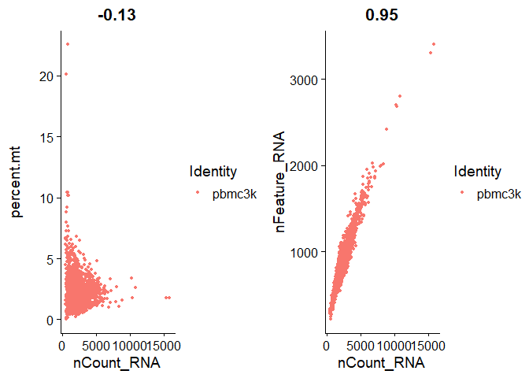<!-- -->

**nCount_RNA vs. percent.mt**: High-quality, healthy cells (low
percent.mt shown in the bottom-left cluster) generally scale up to have
a healthy amount of total RNA (nCount_RNA). Conversely, the dead or
dying cells sitting near the top of the y-axis (\>10% mitochondrial
reads) have very low overall counts because their cytoplasmic RNA has
leaked away.

**nCount_RNA vs. nFeature_RNA**: Near-perfect linear correlation of 0.95
is the hallmark of a high-quality dataset, more molecules from a cell
correlate to more unique genes. Cells that lie way up and to the right
are suspect for being doublets. Cells clustered near the bottom-left are
typically empty droplets or low-quality cells that failed to capture
sufficient RNA.

``` r
# Filter the dataset to retain only high-quality cells based on QC thresholds.
pbmc <- subset(x = pbmc, subset = nFeature_RNA > 200 & nFeature_RNA < 2500 & percent.mt < 5)

# Print a summary of the newly filtered Seurat object
pbmc
```

    ## An object of class Seurat 
    ## 13714 features across 2638 samples within 1 assay 
    ## Active assay: RNA (13714 features, 0 variable features)
    ##  1 layer present: counts

Filtering step successfully discarded 62 low-quality cells (dropping
from 2,700 to 2,638 samples) that failed the gene count or mitochondrial
thresholds. The number of genes remained exactly the same (13,714), as
the subset function only removes poor-quality cells (columns) without
altering the genomic features (rows).

#### 3b. Data Normalization

Different cells are sequenced to different depths, meaning some cells
naturally have more total reads than others purely due to technical
variation.

The traditional workflow uses **LogNormalize, FindVariableFeatures
followd by ScaleData** which often fails to completely remove the
technical noise associated with sequencing depth. Highly sequenced cells
still cluster together purely because they have more reads.

**SCTransform** (introduced by Hafemeister and Satija) replaces those
three distinct steps with a single, elegant framework based on
regularized negative binomial regression.

``` r
# Run ScTransform normalization and scaling while regressing technical variation caused by mitochondrial contamination/cell stress
pbmc <- SCTransform(pbmc, vars.to.regress = "percent.mt", verbose = FALSE)
```

    ## Warning: The `slot` argument of `GetAssayData()` is deprecated as of SeuratObject 5.0.0.
    ## ℹ Please use the `layer` argument instead.
    ## ℹ The deprecated feature was likely used in the Seurat package.
    ##   Please report the issue at <https://github.com/satijalab/seurat/issues>.
    ## This warning is displayed once every 8 hours.
    ## Call `lifecycle::last_lifecycle_warnings()` to see where this warning was
    ## generated.

    ## Warning: The `slot` argument of `SetAssayData()` is deprecated as of SeuratObject 5.0.0.
    ## ℹ Please use the `layer` argument instead.
    ## ℹ The deprecated feature was likely used in the Seurat package.
    ##   Please report the issue at <https://github.com/satijalab/seurat/issues>.
    ## This warning is displayed once every 8 hours.
    ## Call `lifecycle::last_lifecycle_warnings()` to see where this warning was
    ## generated.

#### 3c. Perform linear dimensional reduction

``` r
# Perform Principal Component Analysis (PCA) on the Seurat object
pbmc <- RunPCA(pbmc, verbose = FALSE)
```

``` r
# Print the top-contributing features (genes) for the first 5 Principal Components.
print(pbmc[["pca"]], dims = 1:5, nfeatures = 5)
```

    ## PC_ 1 
    ## Positive:  FTL, LYZ, FTH1, CST3, S100A9 
    ## Negative:  MALAT1, RPS27A, CCL5, LTB, RPS6 
    ## PC_ 2 
    ## Positive:  HLA-DRA, CD74, CD79A, HLA-DPB1, HLA-DQA1 
    ## Negative:  NKG7, CCL5, GZMB, GNLY, GZMA 
    ## PC_ 3 
    ## Positive:  CD74, HLA-DRA, CD79A, HLA-DPB1, HLA-DQA1 
    ## Negative:  S100A8, S100A9, LYZ, RPS12, FTL 
    ## PC_ 4 
    ## Positive:  FCGR3A, LST1, FCER1G, AIF1, IFITM3 
    ## Negative:  S100A8, S100A9, LYZ, LGALS2, CD14 
    ## PC_ 5 
    ## Positive:  GNLY, GZMB, FGFBP2, FCGR3A, PRF1 
    ## Negative:  CCL5, GPX1, PPBP, PF4, SDPR

**Cell Type Signatures**:

**PC_1**: Driven on the positive end by myeloid/monocyte markers (LYZ,
CST3, S100A9).

**PC_2**: Separates B cells/Antigen-Presenting Cells (positive markers:
MHC-II genes like HLA-DRA, CD74, CD79A) from Cytotoxic T and NK cells
(negative markers: killer proteins like NKG7, GZMB, GNLY, GZMA).

**PC_4**: Distinctly separates CD16+ non-classical monocytes (positive
markers: FCGR3A / CD16, LST1) from classical CD14+ monocytes (negative
markers: CD14, S100A8, S100A9).

**PC_5**: Captures Megakaryocytes/Platelets on its negative axis
(markers: PPBP, PF4).

``` r
# Generate a heatmap for the first Principal Component
DimHeatmap(pbmc, dims = 1, cells = 500, balanced = TRUE)
```

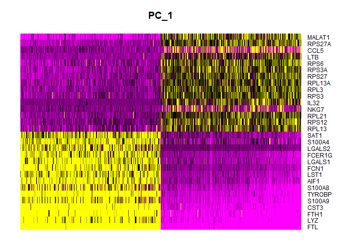<!-- -->

**Left-side Cells (Myeloid/Monocytes)**: high expression of S100A8,
S100A9, LST1, FTL, and FTH1.

**Right-side Cells (Lymphocytes - T, B, and NK cells)**: high expression
of ribosomal proteins (RPS/RPL genes), LTB (Lymphotoxin-beta), and NKG7
(Natural killer cell granule protein 7).

``` r
# Determine dimensionality of the data
ElbowPlot(pbmc)
```

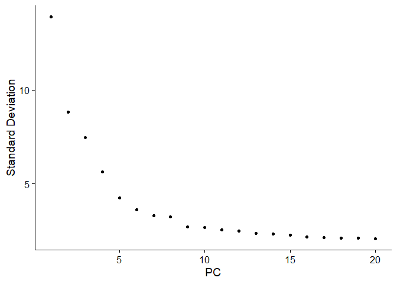<!-- -->
For this dataset, selecting 10 dimensions (dims = 1:10) is the classic,
ideal cutoff. This threshold successfully captures over 90% of the true
biological variation while safely excluding the flat “tail” of random
background noise.

#### 3d. Clustering

Seurat first construct a KNN graph based on the euclidean distance in
the 10-dimensional PCA space, and refine the edge weights between any
two cells based on the shared overlap in their local neighborhoods
(Jaccard similarity).

``` r
# Construct Shared Nearest-neighbor (SNN) graph 
pbmc <- FindNeighbors(pbmc, dims = 1:10, verbose = FALSE)
```

    ## Warning: package 'future' was built under R version 4.4.3

``` r
# Cluster the cells using a modularity optimization algorithm (like the Louvain algorithm).
# The resolution parameter that sets the granularity of the downstream clustering, with increased values leading to a greater number of clusters
pbmc <- FindClusters(pbmc, verbose = FALSE, resolution = c(0.2, 0.4, 0.6, 0.8, 1))
```

``` r
# # Visualize the impact of different clustering granularities (resolutions) on your UMAP:
DimPlot(pbmc, group.by = "SCT_snn_res.0.2", label = TRUE)
```

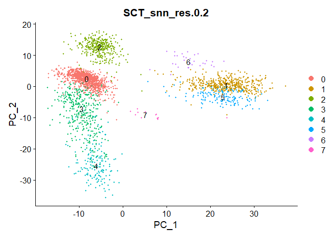<!-- -->

``` r
DimPlot(pbmc, group.by = "SCT_snn_res.0.4", label = TRUE)
```

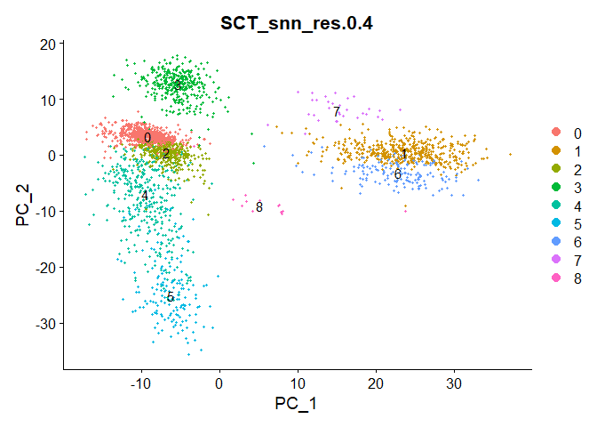<!-- -->

``` r
DimPlot(pbmc, group.by = "SCT_snn_res.0.6", label = TRUE)
```

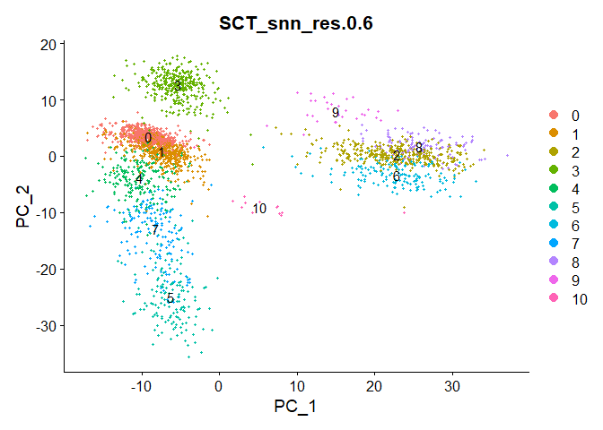<!-- -->

``` r
DimPlot(pbmc, group.by = "SCT_snn_res.0.8", label = TRUE)
```

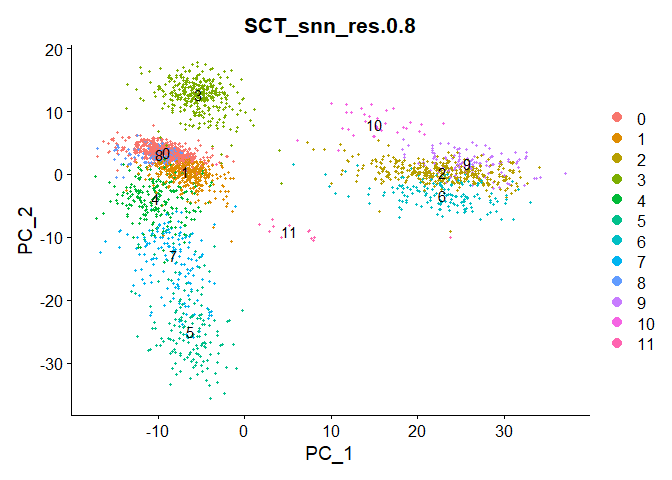<!-- -->

These plots project cells onto PC_1 vs. PC_2 rather than a UMAP. Because
PCA is a linear reduction, looking at only the first two dimensions
causes different cell types to overlap and look stacked on top of each
other.

``` r
# Run the Uniform Manifold Approximation and Projection (UMAP) dimensional reduction.
pbmc <- RunUMAP(object = pbmc, dims = 1:10)
```

    ## Warning: The default method for RunUMAP has changed from calling Python UMAP via reticulate to the R-native UWOT using the cosine metric
    ## To use Python UMAP via reticulate, set umap.method to 'umap-learn' and metric to 'correlation'
    ## This message will be shown once per session

    ## 15:36:21 UMAP embedding parameters a = 0.9922 b = 1.112

    ## 15:36:21 Read 2638 rows and found 10 numeric columns

    ## 15:36:21 Using Annoy for neighbor search, n_neighbors = 30

    ## 15:36:21 Building Annoy index with metric = cosine, n_trees = 50

    ## 0%   10   20   30   40   50   60   70   80   90   100%

    ## [----|----|----|----|----|----|----|----|----|----|

    ## **************************************************|
    ## 15:36:22 Writing NN index file to temp file C:\Users\lalm\AppData\Local\Temp\RtmpA9WC4j\file922062e54473
    ## 15:36:22 Searching Annoy index using 1 thread, search_k = 3000
    ## 15:36:22 Annoy recall = 100%
    ## 15:36:23 Commencing smooth kNN distance calibration using 1 thread with target n_neighbors = 30
    ## 15:36:24 Initializing from normalized Laplacian + noise (using RSpectra)
    ## 15:36:24 Commencing optimization for 500 epochs, with 105118 positive edges
    ## 15:36:24 Using rng type: pcg
    ## 15:36:30 Optimization finished

``` r
# Plot UMAP colored by a specific clustering resolution
DimPlot(pbmc, reduction = "umap", group.by = "SCT_snn_res.0.2")
```

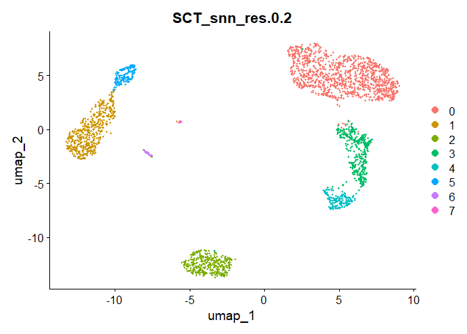<!-- -->

``` r
DimPlot(pbmc, reduction = "umap", group.by = "SCT_snn_res.0.4")
```

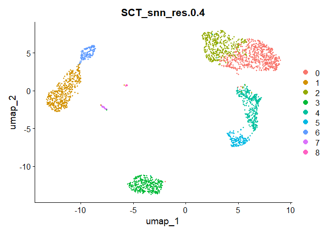<!-- -->

``` r
DimPlot(pbmc, reduction = "umap", group.by = "SCT_snn_res.0.6")
```

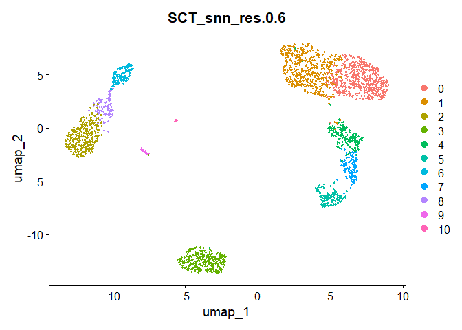<!-- -->

``` r
DimPlot(pbmc, reduction = "umap", group.by = "SCT_snn_res.0.8")
```

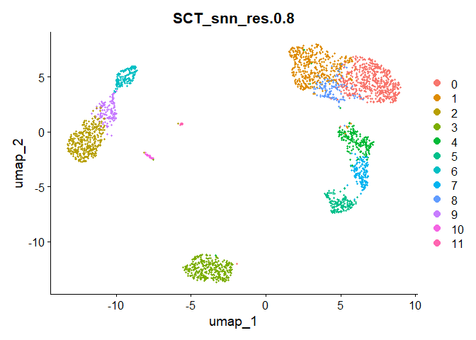<!-- -->

Once you run UMAP—which is non-linear and uses your cell-to-cell
neighbor graph—these overlapping groups will stretch and untangle into
beautifully isolated “islands” representing distinct cell types.

- **res.0.2 (Under-clustered)**: Too broad.
- **res.0.4 (The Sweet Spot)**: Best for most analyses. It cleanly
  separates major cell subtypes (like splitting the top-right T-cell
  island into two halves) without creating messy, artificial boundaries.
- **res.0.6 (Highly Detailed)**: Good if you want to study subtle
  functional states or find rare immune cell populations.
- **res.0.8 (Over-clustered)**: Too granular. The speckled, intermingled
  clusters on the top-right island show that the algorithm is drawing
  arbitrary lines through a single, continuous cell population.

``` r
# Setting identity of clusters
Idents(pbmc) <- "SCT_snn_res.0.4"
View(pbmc@meta.data)
```

### QC Additions to Strengthen the Pipeline

**1. Ambient RNA Removal (DeconTx)** Immediately after creating the
Seurat object (before any filtering

**2. Doublet Removal (DoubletFinder)** Directly after running your
initial PCA and UMAP, but before final clustering.

**3. Cluster Resolution Selection (clustree)** Right after running
FindClusters with multiple resolutions.

### Downstream Analysis (Next Steps)

**1. Marker Gene Identification & Cell-Type Annotation** To discover
what cell types your UMAP islands actually represent, run differential
expression to find highly enriched genes in each cluster and then
cross-reference these marker genes with known biological databases.

**2. Differential Expression (DE) & Pathway Analysis** Compare gene
expression profiles between conditions (e.g., Healthy vs. Treated CD4+
T-cells) to identify upregulated pathways using tools like Gene Ontology
(GO) or GSEA (Gene Set Enrichment Analysis).

**3. Trajectory Inference (Pseudotime Analysis)** Model cells along a
transitional timeline using tools like Monocle3, useful for studying
continuous biological processes, such as stem cell differentiation or
T-cell exhaustion

**4. Cell-Cell Communication Analysis** Map ligand-receptor interactions
to see how the annotated cell types talk to each other. Tools like
CellChat or CellPhoneDB scan the clusters for pairs of genes known to
encode matching ligands and receptors (e.g., a T-cell releasing a
cytokine and a myeloid cell expressing its receptor).
