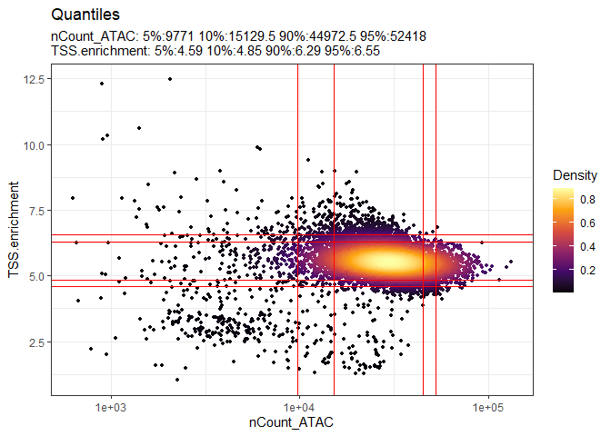
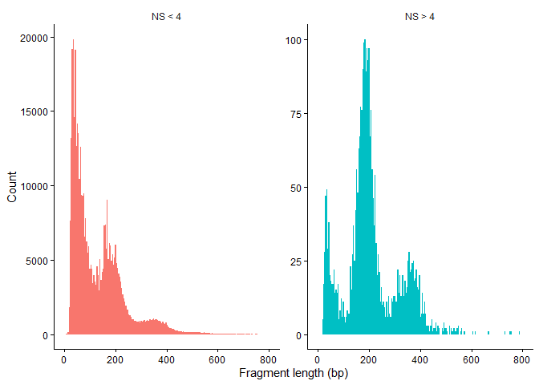
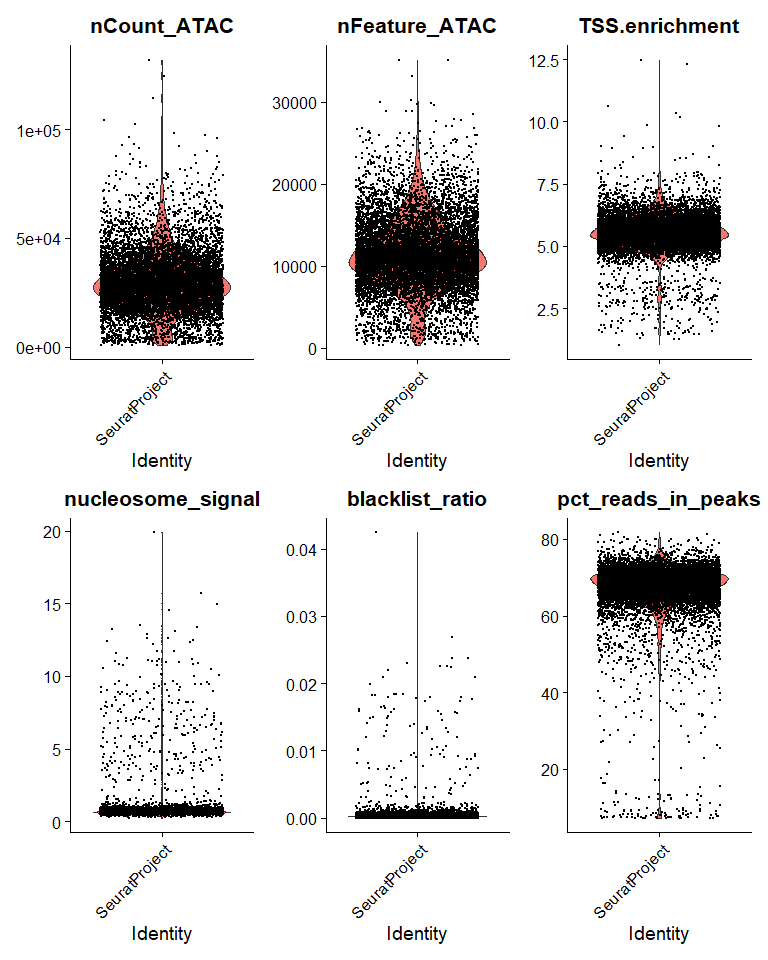
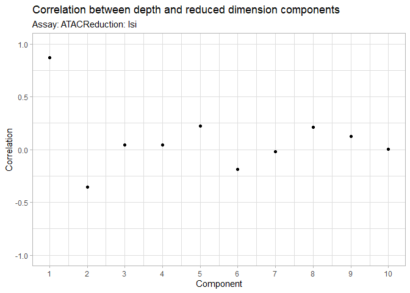
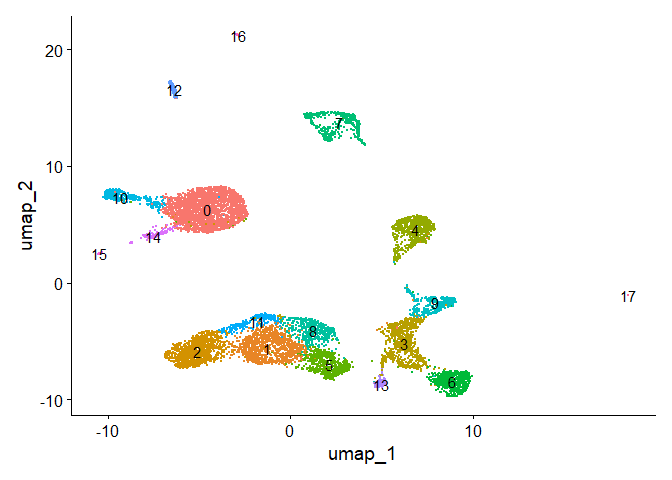

scATAC-seq analysis
================

For this tutorial, we will be analyzing the Peripheral Blood Mononuclear
Cells (PBMC) data available from 10X Genomics. The data comprises of
10,246 PBMC that were sequenced on the Illumina NovaSeq 6000 to
approximately 55k read pairs per cell.

### 1. Set working directory and load libraries

``` r
# setwd("Github/10XGenomics_Pipeline/2. scATAC-seq/")
```

``` r
# Tool for QC, normalization, dimensionality reduction, and clustering of single-cell datasets
library(Seurat) 
```

    ## Loading required package: SeuratObject

    ## Warning: package 'SeuratObject' was built under R version 4.4.3

    ## Loading required package: sp

    ## 
    ## Attaching package: 'SeuratObject'

    ## The following objects are masked from 'package:base':
    ## 
    ##     intersect, t

``` r
# Tool for analysis of single-cell chromatin data including peak calling, fragment analysis, and genomic visualizations
library(Signac)
```

    ## Warning: package 'Signac' was built under R version 4.4.3

``` r
# Infrastructure for representing and manipulating genomic intervals and annotations
library(GenomicRanges)
```

    ## Warning: package 'GenomicRanges' was built under R version 4.4.1

    ## Loading required package: stats4

    ## Loading required package: BiocGenerics

    ## 
    ## Attaching package: 'BiocGenerics'

    ## The following object is masked from 'package:SeuratObject':
    ## 
    ##     intersect

    ## The following objects are masked from 'package:stats':
    ## 
    ##     IQR, mad, sd, var, xtabs

    ## The following objects are masked from 'package:base':
    ## 
    ##     anyDuplicated, aperm, append, as.data.frame, basename, cbind,
    ##     colnames, dirname, do.call, duplicated, eval, evalq, Filter, Find,
    ##     get, grep, grepl, intersect, is.unsorted, lapply, Map, mapply,
    ##     match, mget, order, paste, pmax, pmax.int, pmin, pmin.int,
    ##     Position, rank, rbind, Reduce, rownames, sapply, setdiff, table,
    ##     tapply, union, unique, unsplit, which.max, which.min

    ## Loading required package: S4Vectors

    ## Warning: package 'S4Vectors' was built under R version 4.4.1

    ## 
    ## Attaching package: 'S4Vectors'

    ## The following object is masked from 'package:utils':
    ## 
    ##     findMatches

    ## The following objects are masked from 'package:base':
    ## 
    ##     expand.grid, I, unname

    ## Loading required package: IRanges

    ## Warning: package 'IRanges' was built under R version 4.4.1

    ## 
    ## Attaching package: 'IRanges'

    ## The following object is masked from 'package:sp':
    ## 
    ##     %over%

    ## The following object is masked from 'package:grDevices':
    ## 
    ##     windows

    ## Loading required package: GenomeInfoDb

``` r
# Utilities for manipulating chromosome names and genome assembly annotations
library(GenomeInfoDb)

# Client interface for accessing genomic datasets and annotations from Bioconductor's AnnotationHub
library(AnnotationHub)
```

    ## Loading required package: BiocFileCache

    ## Loading required package: dbplyr

``` r
## Tool for data manipulation, cleaning, and visualization of tabular data
library(tidyverse)
```

    ## Warning: package 'ggplot2' was built under R version 4.4.3

    ## Warning: package 'stringr' was built under R version 4.4.3

    ## Warning: package 'forcats' was built under R version 4.4.3

    ## Warning: package 'lubridate' was built under R version 4.4.2

    ## ── Attaching core tidyverse packages ──────────────────────── tidyverse 2.0.0 ──
    ## ✔ dplyr     1.1.4     ✔ readr     2.1.5
    ## ✔ forcats   1.0.1     ✔ stringr   1.6.0
    ## ✔ ggplot2   4.0.3     ✔ tibble    3.2.1
    ## ✔ lubridate 1.9.4     ✔ tidyr     1.3.1
    ## ✔ purrr     1.0.2

    ## ── Conflicts ────────────────────────────────────────── tidyverse_conflicts() ──
    ## ✖ lubridate::%within%() masks IRanges::%within%()
    ## ✖ dplyr::collapse()     masks IRanges::collapse()
    ## ✖ dplyr::combine()      masks BiocGenerics::combine()
    ## ✖ dplyr::desc()         masks IRanges::desc()
    ## ✖ tidyr::expand()       masks S4Vectors::expand()
    ## ✖ dplyr::filter()       masks stats::filter()
    ## ✖ dplyr::first()        masks S4Vectors::first()
    ## ✖ dplyr::ident()        masks dbplyr::ident()
    ## ✖ dplyr::lag()          masks stats::lag()
    ## ✖ ggplot2::Position()   masks BiocGenerics::Position(), base::Position()
    ## ✖ purrr::reduce()       masks GenomicRanges::reduce(), IRanges::reduce(), Signac::reduce()
    ## ✖ dplyr::rename()       masks S4Vectors::rename()
    ## ✖ lubridate::second()   masks S4Vectors::second()
    ## ✖ lubridate::second<-() masks S4Vectors::second<-()
    ## ✖ dplyr::slice()        masks IRanges::slice()
    ## ✖ dplyr::sql()          masks dbplyr::sql()
    ## ℹ Use the conflicted package (<http://conflicted.r-lib.org/>) to force all conflicts to become errors

### 2. Load the PBMC dataset

The raw data can be found here -

- <https://cf.10xgenomics.com/samples/cell-atac/2.1.0/10k_pbmc_ATACv2_nextgem_Chromium_Controller/10k_pbmc_ATACv2_nextgem_Chromium_Controller_filtered_peak_bc_matrix.h5>
- <https://cf.10xgenomics.com/samples/cell-atac/2.1.0/10k_pbmc_ATACv2_nextgem_Chromium_Controller/10k_pbmc_ATACv2_nextgem_Chromium_Controller_singlecell.csv>
- <https://cf.10xgenomics.com/samples/cell-atac/2.1.0/10k_pbmc_ATACv2_nextgem_Chromium_Controller/10k_pbmc_ATACv2_nextgem_Chromium_Controller_fragments.tsv.gz>
- <https://cf.10xgenomics.com/samples/cell-atac/2.1.0/10k_pbmc_ATACv2_nextgem_Chromium_Controller/10k_pbmc_ATACv2_nextgem_Chromium_Controller_fragments.tsv.gz.tbi>

``` r
# Load the peak-by-barcode count matrix
counts <- Read10X_h5('10k_pbmc_ATACv2_nextgem_Chromium_Controller_filtered_peak_bc_matrix.h5')
counts[1:10,1:10]
```

    ## 10 x 10 sparse Matrix of class "dgCMatrix"

    ##   [[ suppressing 10 column names 'AAACGAAAGAGAGGTA-1', 'AAACGAAAGCAGGAGG-1', 'AAACGAAAGGAAGAAC-1' ... ]]

    ##                                       
    ## chr1:9772-10660    . . . . . . . . . .
    ## chr1:180712-181178 . . . . . . . . . .
    ## chr1:181200-181607 . . . . . . . . . .
    ## chr1:191183-192084 . . . . . . . . . .
    ## chr1:267576-268461 . . . . . . . . . .
    ## chr1:270850-271755 . . . . . . . . . .
    ## chr1:273946-274792 . . . . . . . . . .
    ## chr1:585753-586648 . . . . . . . . . .
    ## chr1:605079-605959 . . . . . . . . . .
    ## chr1:629538-630397 . . . . . . . . 2 .

The symbol “.” represent zero counts in R’s sparse matrix format, which
is expected because single-cell ATAC-seq data is naturally highly sparse
with mostly 0s, 1s, or 2s.

``` r
# Create Chromatin Assay object to link peak count matrix with raw fragment file containing individual reads
chrom_assay <- CreateChromatinAssay(
  counts = counts,
  sep = c(":", "-"),
  fragments = "10k_pbmc_ATACv2_nextgem_Chromium_Controller_fragments.tsv.gz",
  min.cells = 10, 
  min.features = 200
)
```

    ## Computing hash

``` r
chrom_assay
```

    ## ChromatinAssay data with 165434 features for 10246 cells
    ## Variable features: 0 
    ## Genome: 
    ## Annotation present: FALSE 
    ## Motifs present: FALSE 
    ## Fragment files: 1

The ChromatinAssay object stores 165,434 genomic peaks across 10,246
cells along with the fragment file links. Currently, optional slots like
gene annotations and motif matrices are empty, which is completely
expected before downstream annotation.

``` r
# Read per-cell metrics (e.g., total reads, TSS enrichment scores) from 10x Cell Ranger output CSV
metadata <- read.csv(file = '10k_pbmc_ATACv2_nextgem_Chromium_Controller_singlecell.csv', 
                     header = T, row.names = 1)
head(metadata)
```

    ##                       total duplicate chimeric unmapped lowmapq mitochondrial
    ## NO_BARCODE         20081988   3972351     3423  2118408 1159348         23059
    ## AAACGAAAGAAACGCC-1        4         0        0        0       0             0
    ## AAACGAAAGAAAGCAG-1        3         0        0        0       0             0
    ## AAACGAAAGAAAGGGT-1        2         0        0        0       0             0
    ## AAACGAAAGAAATACC-1       17         0        0        0       0             0
    ## AAACGAAAGAAATCTG-1        1         0        0        0       0             0
    ##                    nonprimary passed_filters is__cell_barcode excluded_reason
    ## NO_BARCODE               4131       12801268                0               0
    ## AAACGAAAGAAACGCC-1          0              4                0               0
    ## AAACGAAAGAAAGCAG-1          0              3                0               0
    ## AAACGAAAGAAAGGGT-1          0              2                0               0
    ## AAACGAAAGAAATACC-1          0             17                0               0
    ## AAACGAAAGAAATCTG-1          0              1                0               2
    ##                    TSS_fragments DNase_sensitive_region_fragments
    ## NO_BARCODE                     0                                0
    ## AAACGAAAGAAACGCC-1             1                                0
    ## AAACGAAAGAAAGCAG-1             0                                0
    ## AAACGAAAGAAAGGGT-1             0                                0
    ## AAACGAAAGAAATACC-1            11                                0
    ## AAACGAAAGAAATCTG-1             0                                0
    ##                    enhancer_region_fragments promoter_region_fragments
    ## NO_BARCODE                                 0                         0
    ## AAACGAAAGAAACGCC-1                         0                         0
    ## AAACGAAAGAAAGCAG-1                         0                         0
    ## AAACGAAAGAAAGGGT-1                         0                         0
    ## AAACGAAAGAAATACC-1                         0                         0
    ## AAACGAAAGAAATCTG-1                         0                         0
    ##                    on_target_fragments blacklist_region_fragments
    ## NO_BARCODE                           0                          0
    ## AAACGAAAGAAACGCC-1                   1                          0
    ## AAACGAAAGAAAGCAG-1                   0                          0
    ## AAACGAAAGAAAGGGT-1                   0                          0
    ## AAACGAAAGAAATACC-1                  11                          0
    ## AAACGAAAGAAATCTG-1                   0                          0
    ##                    peak_region_fragments peak_region_cutsites
    ## NO_BARCODE                             0                    0
    ## AAACGAAAGAAACGCC-1                     2                    4
    ## AAACGAAAGAAAGCAG-1                     1                    2
    ## AAACGAAAGAAAGGGT-1                     1                    2
    ## AAACGAAAGAAATACC-1                    14                   27
    ## AAACGAAAGAAATCTG-1                     0                    0

The metadata details read alignment quality, mapping locations, and
genomic region coverage for every barcode. The NO_BARCODE row holds
unassigned reads, while individual cell rows report quality control
metrics used to filter out low-quality cells or empty droplets.

``` r
# Create a Seurat Object
pbmc <- CreateSeuratObject(
  counts = chrom_assay,
  meta.data = metadata,
  assay = 'ATAC'
)

pbmc
```

    ## An object of class Seurat 
    ## 165434 features across 10246 samples within 1 assay 
    ## Active assay: ATAC (165434 features, 0 variable features)
    ##  2 layers present: counts, data

Fully assembled Seurat object contain the ATAC assay (165,434 peaks
across 10,246 cells) with all 21 metadata columns successfully merged.
Both genomic accessibility counts and single-cell quality control
metrics (like TSS fragments and peak region reads) are available in one
object.

``` r
# Extract genomic coordinates (chromosomal locations, start/end positions, and strand info)
granges(pbmc)
```

    ## GRanges object with 165434 ranges and 0 metadata columns:
    ##              seqnames        ranges strand
    ##                 <Rle>     <IRanges>  <Rle>
    ##        [1]       chr1    9772-10660      *
    ##        [2]       chr1 180712-181178      *
    ##        [3]       chr1 181200-181607      *
    ##        [4]       chr1 191183-192084      *
    ##        [5]       chr1 267576-268461      *
    ##        ...        ...           ...    ...
    ##   [165430] KI270713.1   13054-13909      *
    ##   [165431] KI270713.1   15212-15933      *
    ##   [165432] KI270713.1   21459-22358      *
    ##   [165433] KI270713.1   29676-30535      *
    ##   [165434] KI270713.1   36913-37813      *
    ##   -------
    ##   seqinfo: 35 sequences from an unspecified genome; no seqlengths

The output summarizes all 165,434 identified ATAC-seq peak coordinates
across 35 sequences in your dataset. Notice that it still includes
unplaced scaffold contigs (like KI270713.1)

``` r
# Identify peaks located on standard chromosomes to exclude unplaced contigs, scaffolds, and assembly patches
peaks.keep <- seqnames(granges(pbmc)) %in% standardChromosomes(granges(pbmc))

# Subset the Seurat object to retain only peaks mapped to standard chromosomes
pbmc <- pbmc[as.vector(peaks.keep), ]

# Inspect the filtered GRanges object to confirm only standard chromosomes remain
granges(pbmc)
```

    ## GRanges object with 165376 ranges and 0 metadata columns:
    ##            seqnames            ranges strand
    ##               <Rle>         <IRanges>  <Rle>
    ##        [1]     chr1        9772-10660      *
    ##        [2]     chr1     180712-181178      *
    ##        [3]     chr1     181200-181607      *
    ##        [4]     chr1     191183-192084      *
    ##        [5]     chr1     267576-268461      *
    ##        ...      ...               ...    ...
    ##   [165372]     chrY 21836169-21837044      *
    ##   [165373]     chrY 26408700-26409528      *
    ##   [165374]     chrY 26670683-26671627      *
    ##   [165375]     chrY 56734346-56735236      *
    ##   [165376]     chrY 56836407-56837286      *
    ##   -------
    ##   seqinfo: 35 sequences from an unspecified genome; no seqlengths

The output shows that unplaced scaffold contigs (such as KI270713.1)
were successfully removed, reducing the dataset to 165,376 peaks mapped
exclusively to standard chromosomes.

#### 3. Add Gene Annotation

``` r
# Search for the Ensembl 98 EnsDb for Homo sapiens on AnnotationHub
query(AnnotationHub(), "EnsDb.Hsapiens.v98")
```

    ## AnnotationHub with 1 record
    ## # snapshotDate(): 2024-04-30
    ## # names(): AH75011
    ## # $dataprovider: Ensembl
    ## # $species: Homo sapiens
    ## # $rdataclass: EnsDb
    ## # $rdatadateadded: 2019-05-02
    ## # $title: Ensembl 98 EnsDb for Homo sapiens
    ## # $description: Gene and protein annotations for Homo sapiens based on Ensem...
    ## # $taxonomyid: 9606
    ## # $genome: GRCh38
    ## # $sourcetype: ensembl
    ## # $sourceurl: http://www.ensembl.org
    ## # $sourcesize: NA
    ## # $tags: c("98", "AHEnsDbs", "Annotation", "EnsDb", "Ensembl", "Gene",
    ## #   "Protein", "Transcript") 
    ## # retrieve record with 'object[["AH75011"]]'

The output confirms that AnnotationHub record AH75011 was successfully
fetched and loaded. It contains the Ensembl version 98 (EnsDb) database
for Homo sapiens, built on the GRCh38 / hg38 human reference genome
assembly.

``` r
# Retrieve the Ensembl v98 annotation database for human (GRCh38) from AnnotationHub
ensdb_v98 <- AnnotationHub()[["AH75011"]]
```

    ## loading from cache

    ## require("ensembldb")

    ## Warning: package 'ensembldb' was built under R version 4.4.1

``` r
# Extract gene, transcript, and exon coordinates from the EnsDb object as a GRanges structure
annotations <- GetGRangesFromEnsDb(ensdb = ensdb_v98)
```

    ## Warning in .merge_two_Seqinfo_objects(x, y): The 2 combined objects have no sequence levels in common. (Use
    ##   suppressWarnings() to suppress this warning.)

    ## Warning in .merge_two_Seqinfo_objects(x, y): The 2 combined objects have no sequence levels in common. (Use
    ##   suppressWarnings() to suppress this warning.)
    ## Warning in .merge_two_Seqinfo_objects(x, y): The 2 combined objects have no sequence levels in common. (Use
    ##   suppressWarnings() to suppress this warning.)
    ## Warning in .merge_two_Seqinfo_objects(x, y): The 2 combined objects have no sequence levels in common. (Use
    ##   suppressWarnings() to suppress this warning.)
    ## Warning in .merge_two_Seqinfo_objects(x, y): The 2 combined objects have no sequence levels in common. (Use
    ##   suppressWarnings() to suppress this warning.)
    ## Warning in .merge_two_Seqinfo_objects(x, y): The 2 combined objects have no sequence levels in common. (Use
    ##   suppressWarnings() to suppress this warning.)
    ## Warning in .merge_two_Seqinfo_objects(x, y): The 2 combined objects have no sequence levels in common. (Use
    ##   suppressWarnings() to suppress this warning.)
    ## Warning in .merge_two_Seqinfo_objects(x, y): The 2 combined objects have no sequence levels in common. (Use
    ##   suppressWarnings() to suppress this warning.)
    ## Warning in .merge_two_Seqinfo_objects(x, y): The 2 combined objects have no sequence levels in common. (Use
    ##   suppressWarnings() to suppress this warning.)
    ## Warning in .merge_two_Seqinfo_objects(x, y): The 2 combined objects have no sequence levels in common. (Use
    ##   suppressWarnings() to suppress this warning.)
    ## Warning in .merge_two_Seqinfo_objects(x, y): The 2 combined objects have no sequence levels in common. (Use
    ##   suppressWarnings() to suppress this warning.)
    ## Warning in .merge_two_Seqinfo_objects(x, y): The 2 combined objects have no sequence levels in common. (Use
    ##   suppressWarnings() to suppress this warning.)
    ## Warning in .merge_two_Seqinfo_objects(x, y): The 2 combined objects have no sequence levels in common. (Use
    ##   suppressWarnings() to suppress this warning.)
    ## Warning in .merge_two_Seqinfo_objects(x, y): The 2 combined objects have no sequence levels in common. (Use
    ##   suppressWarnings() to suppress this warning.)
    ## Warning in .merge_two_Seqinfo_objects(x, y): The 2 combined objects have no sequence levels in common. (Use
    ##   suppressWarnings() to suppress this warning.)
    ## Warning in .merge_two_Seqinfo_objects(x, y): The 2 combined objects have no sequence levels in common. (Use
    ##   suppressWarnings() to suppress this warning.)
    ## Warning in .merge_two_Seqinfo_objects(x, y): The 2 combined objects have no sequence levels in common. (Use
    ##   suppressWarnings() to suppress this warning.)
    ## Warning in .merge_two_Seqinfo_objects(x, y): The 2 combined objects have no sequence levels in common. (Use
    ##   suppressWarnings() to suppress this warning.)
    ## Warning in .merge_two_Seqinfo_objects(x, y): The 2 combined objects have no sequence levels in common. (Use
    ##   suppressWarnings() to suppress this warning.)
    ## Warning in .merge_two_Seqinfo_objects(x, y): The 2 combined objects have no sequence levels in common. (Use
    ##   suppressWarnings() to suppress this warning.)
    ## Warning in .merge_two_Seqinfo_objects(x, y): The 2 combined objects have no sequence levels in common. (Use
    ##   suppressWarnings() to suppress this warning.)
    ## Warning in .merge_two_Seqinfo_objects(x, y): The 2 combined objects have no sequence levels in common. (Use
    ##   suppressWarnings() to suppress this warning.)
    ## Warning in .merge_two_Seqinfo_objects(x, y): The 2 combined objects have no sequence levels in common. (Use
    ##   suppressWarnings() to suppress this warning.)
    ## Warning in .merge_two_Seqinfo_objects(x, y): The 2 combined objects have no sequence levels in common. (Use
    ##   suppressWarnings() to suppress this warning.)

``` r
# Convert chromosome names from Ensembl style (1, 2, X) to UCSC style (chr1, chr2, chrX)
seqlevels(annotations) <- paste0('chr', seqlevels(annotations))
genome(annotations) <- "hg38"

# Attach and confirm the updated GRanges gene annotations (hg38) to the ATAC assay within the Seurat object
Annotation(pbmc) <- annotations
Annotation(pbmc) 
```

    ## GRanges object with 3200207 ranges and 5 metadata columns:
    ##                   seqnames        ranges strand |           tx_id   gene_name
    ##                      <Rle>     <IRanges>  <Rle> |     <character> <character>
    ##   ENSE00001489430     chrX 276322-276394      + | ENST00000399012      PLCXD1
    ##   ENSE00001536003     chrX 276324-276394      + | ENST00000484611      PLCXD1
    ##   ENSE00002160563     chrX 276353-276394      + | ENST00000430923      PLCXD1
    ##   ENSE00001750899     chrX 281055-281121      + | ENST00000445062      PLCXD1
    ##   ENSE00001719251     chrX 281194-281256      + | ENST00000429181      PLCXD1
    ##               ...      ...           ...    ... .             ...         ...
    ##   ENST00000361739    chrMT     7586-8269      + | ENST00000361739      MT-CO2
    ##   ENST00000361789    chrMT   14747-15887      + | ENST00000361789      MT-CYB
    ##   ENST00000361851    chrMT     8366-8572      + | ENST00000361851     MT-ATP8
    ##   ENST00000361899    chrMT     8527-9207      + | ENST00000361899     MT-ATP6
    ##   ENST00000362079    chrMT     9207-9990      + | ENST00000362079      MT-CO3
    ##                           gene_id   gene_biotype     type
    ##                       <character>    <character> <factor>
    ##   ENSE00001489430 ENSG00000182378 protein_coding     exon
    ##   ENSE00001536003 ENSG00000182378 protein_coding     exon
    ##   ENSE00002160563 ENSG00000182378 protein_coding     exon
    ##   ENSE00001750899 ENSG00000182378 protein_coding     exon
    ##   ENSE00001719251 ENSG00000182378 protein_coding     exon
    ##               ...             ...            ...      ...
    ##   ENST00000361739 ENSG00000198712 protein_coding      cds
    ##   ENST00000361789 ENSG00000198727 protein_coding      cds
    ##   ENST00000361851 ENSG00000228253 protein_coding      cds
    ##   ENST00000361899 ENSG00000198899 protein_coding      cds
    ##   ENST00000362079 ENSG00000198938 protein_coding      cds
    ##   -------
    ##   seqinfo: 25 sequences (1 circular) from hg38 genome

The object displays genomic feature annotations (including exons,
transcripts, and CDS) retrieved from the Ensembl database mapped to the
hg38 genome assembly.

#### 4. Standard pre-processing workflow

#### 4a. Compute and visualize QC

**Nucleosome Banding Pattern (nucleosome_signal)**: Measures the ratio
of mononucleosomal to nucleosome-free fragments; high-quality cells show
clear ~147 bp periodicity.

**TSS Enrichment Score (TSS.enrichment)**: Evaluates signal specificity
by comparing fragment counts at transcription start sites versus
flanking background regions.

**Total Fragments in Peaks (nCount_peaks)**: Indicates sequencing depth;
used to filter out low-coverage background droplets and high-coverage
doublets.

**Fraction of Reads in Peaks (pct_reads_in_peaks)**: Quantifies
signal-to-noise ratio; low fractions (\< 15–20%) signal poor capture or
technical artifacts.

**Genomic Blacklist Ratio (blacklist_ratio)**: Calculates the proportion
of reads mapping to known artifact-prone regions using
FractionCountsInRegion().

``` r
# Calculate ATAC-seq QC metrics
# - Ratio of mononucleosomal-to-nucleosome-free fragments per cell
pbmc <- NucleosomeSignal(object = pbmc)
```

    ## Warning in NucleosomeSignal(object = pbmc): 'NucleosomeSignal' is deprecated.
    ## Use 'ATACqc' instead.
    ## See help("Deprecated") and help("Signac-deprecated").

``` r
# - Enrichment of Tn5 insertion sites around transcription  start sites; reflects signal-to-noise quality
pbmc <- TSSEnrichment(object = pbmc)
```

    ## Warning in TSSEnrichment(object = pbmc): 'TSSEnrichment' is deprecated.
    ## Use 'ATACqc' instead.
    ## See help("Deprecated") and help("Signac-deprecated").

    ## Extracting TSS positions

    ## Extracting fragments at TSSs

    ## 
    ## Computing TSS enrichment score

``` r
# - Blacklist Ratio; fraction of fragments overlapping ENCODE blacklist regions
blacklist_regions <- AnnotationHub()[['AH107305']] 
```

    ## loading from cache

``` r
pbmc$blacklist_ratio <- FractionCountsInRegion(object = pbmc, assay = 'ATAC', regions = blacklist_regions)
```

    ## Warning: `FractionCountsInRegion()` was deprecated in Signac 1.17.0.
    ## This warning is displayed once per session.
    ## Call `lifecycle::last_lifecycle_warnings()` to see where this warning was
    ## generated.

``` r
# Calculate FRiP score, the percentage of total passed-filter reads that fall within identified peak regions 
pbmc$pct_reads_in_peaks <- pbmc$peak_region_fragments / pbmc$passed_filters * 100
```

``` r
# Create a density scatter plot comparing total ATAC counts (log scale) vs. TSS enrichment
DensityScatter(pbmc, x = 'nCount_ATAC', y = 'TSS.enrichment', log_x = TRUE, quantiles = TRUE)
```

<!-- -->

The plot compares total ATAC counts against TSS enrichment, with red
lines marking key quantile boundaries across the single-cell population.
Most high-quality cells cluster tightly between 10,000 and 50,000 counts
with TSS enrichment above 1.5, allowing you to easily identify and
filter out low-signal background droplets.

``` r
pbmc$nucleosome_group <- ifelse(pbmc$nucleosome_signal > 4, 'NS > 4', 'NS < 4')
FragmentHistogram(object = pbmc, group.by = 'nucleosome_group')
```

    ## Warning: Removed 63 rows containing non-finite outside the scale range
    ## (`stat_bin()`).

    ## Warning: Removed 4 rows containing missing values or values outside the scale range
    ## (`geom_bar()`).

<!-- -->

The plot shows that high-quality cells (NS \< 4) exhibit expected
ATAC-seq periodicity with a strong nucleosome-free peak (\< 100 bp),
whereas low-quality cells (NS \> 4) lack nucleosome-free reads and are
dominated by mononucleosomal fragments.

``` r
# Generate violin plots for key scATAC-seq quality control metrics across cells
VlnPlot(object = pbmc, 
        features = c('nCount_ATAC', 'nFeature_ATAC', 'TSS.enrichment', 'nucleosome_signal',
                     'blacklist_ratio', 'pct_reads_in_peaks'),
        pt.size = 0.1,
        ncol = 3)
```

<!-- -->

Sequening Depth: Most cells fall within optimal ranges (~10,000–50,000
counts and 5,000–20,000 detected peaks), with minor high-count outliers.

Signal Quality & Specificity: High overall data quality is demonstrated
by strong TSS enrichment scores centered around 5–6 (TSS.enrichment),
high target mapping rates (pct_reads_in_peaks predominantly \> 60%), low
nucleosome ratios (nucleosome_signal mostly \< 2), and minimal genomic
artifact background (blacklist_ratio near 0).

#### 4b. Filter poor quality cells

``` r
# Apply Quality Control (QC) filters to retain only high-quality single cells
pbmc <- subset(
  x = pbmc,
  subset = nCount_ATAC > 9000 &
    nCount_ATAC < 100000 &
    pct_reads_in_peaks > 40 &
    blacklist_ratio < 0.01 &
    nucleosome_signal < 4 &
    TSS.enrichment > 4
)

pbmc
```

    ## An object of class Seurat 
    ## 165376 features across 9651 samples within 1 assay 
    ## Active assay: ATAC (165376 features, 0 variable features)
    ##  2 layers present: counts, data

The dataset retained 9,651 high-quality cells across 165,376 peaks after
QC filtering. The active ATAC assay is clean and ready for TF-IDF
normalization, LSI dimensionality reduction, and clustering.

#### 4C. Normalization and linear dimensional reduction

**Normalization (RunTFIDF)**: Applies Term Frequency-Inverse Document
Frequency (TF-IDF) to adjust for differences in cell sequencing depth
and weigh rare peaks higher than common ones.

**Feature Selection (FindTopFeatures)**: Selects peaks for downstream
analysis by filtering out rare features or picking the top
top-performing percentage (e.g., setting min.cutoff = ‘q75’), saving
selected peaks to VariableFeatures().

**Dimensionality Reduction (RunSVD)**: Performs Singular Value
Decomposition on the normalized TF-IDF matrix to generate Latent
Semantic Indexing (LSI) components, providing a low-dimensional
representation analogous to PCA.

The combined steps of TF-IDF followed by SVD are known as **latent
semantic indexing (LSI)**, and were first introduced for the analysis of
scATAC-seq data by Cusanovich et al. 2015.

``` r
# Perform TF-IDF normalization to adjust for cellular sequencing depth and weight rare peaks
pbmc <- RunTFIDF(pbmc)
```

    ## Performing TF-IDF normalization

``` r
# Select peaks for downstream analysis; retains 100% of peaks and sets them as VariableFeatures)
pbmc <- FindTopFeatures(pbmc, min.cutoff = 'q0')

# Perform Singular Value Decomposition (SVD) on the TF-IDF matrix to generate LSI dimensional reduction
pbmc <- RunSVD(pbmc)
```

    ## Running SVD

    ## Scaling cell embeddings

The **DepthCor()** function quantifies the relationship between each LSI
component and cellular depth to guide component selection.

``` r
# # Compute Pearson correlation between total sequencing depth (nCount_ATAC) and each LSI component 
DepthCor(pbmc)
```

<!-- -->

The plot shows that the first LSI component frequently correlates with
total sequencing depth rather than true biology and must be excluded
from downstream steps.

#### 4D. Non-linear dimensional reduction and Clustering

``` r
# Non-linear dimensional reduction using UMAP on LSI components 2 to 30 (excluding LSI 1 due to depth correlation)
pbmc <- RunUMAP(object = pbmc, reduction = 'lsi', dims = 2:30)
```

    ## Warning: The default method for RunUMAP has changed from calling Python UMAP via reticulate to the R-native UWOT using the cosine metric
    ## To use Python UMAP via reticulate, set umap.method to 'umap-learn' and metric to 'correlation'
    ## This message will be shown once per session

    ## 17:49:43 UMAP embedding parameters a = 0.9922 b = 1.112

    ## 17:49:43 Read 9651 rows and found 29 numeric columns

    ## 17:49:43 Using Annoy for neighbor search, n_neighbors = 30

    ## 17:49:43 Building Annoy index with metric = cosine, n_trees = 50

    ## 0%   10   20   30   40   50   60   70   80   90   100%

    ## [----|----|----|----|----|----|----|----|----|----|

    ## **************************************************|
    ## 17:49:44 Writing NN index file to temp file C:\Users\lalm\AppData\Local\Temp\RtmpygZn4z\file60907f33840
    ## 17:49:44 Searching Annoy index using 1 thread, search_k = 3000
    ## 17:49:47 Annoy recall = 100%
    ## 17:49:48 Commencing smooth kNN distance calibration using 1 thread with target n_neighbors = 30
    ## 17:49:50 Initializing from normalized Laplacian + noise (using RSpectra)
    ## 17:49:51 Commencing optimization for 500 epochs, with 384638 positive edges
    ## 17:49:51 Using rng type: pcg
    ## 17:50:13 Optimization finished

``` r
# Construct a Shared Nearest Neighbor (SNN) graph based on the selected LSI dimensions
pbmc <- FindNeighbors(object = pbmc, reduction = 'lsi', dims = 2:30)
```

    ## Computing nearest neighbor graph
    ## Computing SNN

``` r
# Identify cell clusters using the SLM algorithm (algorithm = 3) on the SNN graph
pbmc <- FindClusters(object = pbmc, verbose = FALSE, algorithm = 3)

# Visualize clusters on the UMAP projection with cluster IDs labeled directly on the plot
DimPlot(object = pbmc, label = TRUE) + NoLegend()
```

<!-- -->

The UMAP visualization cleanly resolves the PBMC dataset into 18
distinct clusters (0–17) based on chromatin accessibility profiles.

### Downstream Analysis (Next Steps)

**Gene Activity Matrix Calculation** Convert sparse chromatin
accessibility (peaks) into pseudo-gene expression levels to help
identify cell types using known RNA markers.

**Cell Type Annotation & Label Transfer** Map single-cell ATAC-seq
clusters to a reference scRNA-seq dataset or annotate using canonical
cell-type markers (e.g., CD3D for T cells, MS4A1 for B cells, CD14 for
Monocytes).

**Differential Accessibility Analysis** Identify cell-type-specific
genomic regions (peaks) that are significantly more or less accessible
between clusters.

**Motif & Transcription Factor (TF) Enrichment** Uncover the regulatory
drivers (transcription factor binding motifs) controlling cell-type
specific chromatin accessibility.

**ChromVAR Footprinting & Single-Cell TF Activity** Infer transcription
factor activity on a per-cell basis and analyze fine-scale TF binding
footprints.

**Genomic Coverage & Track Visualization** Inspect accessibility
profiles at specific genomic loci (e.g., key locus peaks, gene
promoters, enhancers) across clusters.
